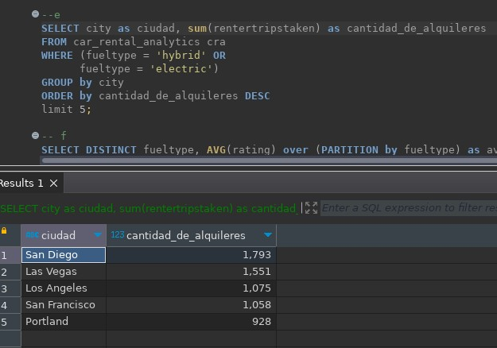

# Ejercicio 2 - Alquiler de automóviles
> Una de las empresas líderes en alquileres de automóviles solicita una serie de dashboards y reportes para poder basar sus decisiones en datos. Entre los indicadores mencionados se encuentran total de alquileres, segmentación por tipo de combustible, lugar, marca y modelo de automóvil, valoración de cada alquiler, etc. Como Data Engineer debe crear y automatizar el pipeline para tener como resultado los datos listos para ser visualizados y responder las preguntas de negocio.

## Tareas
### Ingest
Ver `ingest-informe-rental.sh` que es ejecutado por el DAG de Airflow.
### Crear tablas en Hive
Primero copiar estos archivos a su contenedor de hadoop, en mi caso es:
`docker cp edvai_hadoop:/home/hadoop/scripts/<dirección de crea_tablas_informe-rental.hql>`
Luego ejecutar el script de hive;
`hive -f /home/hadoop/scripts/crea_tablas_informe-anac.hql`
### Transformación
Ver `transform-informe-rental.py` que es ejecutado por el DAG de Airflow.
### Orquestación
El proceso completo se ejecuta desde Airflow, con el DAG `dag-informe-anac.py`

*La tarea de xcom quedó solo con función didáctica pero no cumple funciones en el pipeline. Carga unos xcom con los nombres de los archivos.
### Análisis de datos
Esquema de tablas:
- Esquema de tabla car_rental_analytics

#### Por medio de consultas SQL al data-warehouse, mostrar:
1. Cantidad de alquileres de autos, teniendo en cuenta sólo los vehículos ecológicos (fuelType hibrido o eléctrico) y con un rating de al menos 4
   
2. los 5 estados con menor cantidad de alquileres (crear visualización)
   
3. los 10 modelos (junto con su marca) de autos más rentados (crear visualización)
   
4.  Mostrar por año, cuántos alquileres se hicieron, teniendo en cuenta automóviles fabricados desde 2010 a 2015
    
5.   las 5 ciudades con más alquileres de vehículos ecológicos (fuelType hibrido o electrico)
    
6. el promedio de reviews, segmentando por tipo de combustible
    

### Visualización

Con el directorio de trabajo de en la carpeta de este informe ejecutar (suponiendo que tenga instalado python):
`python -m venv ./.venv`
- Si tiene Windows muevase con el comando cd a la carpeta Scripts adentro de .venv y ejecute `activate`
- Si tiene linux `source ./.venv/bin/activate`
Por último encienda el servidor mediante `python dashboard.py`

## Conclusiones
Es un proyecto que muestra que con no demasiada información ya se puede tener una idea del estado de esta empresa que abarca todo Estados Unidos. El proyecto exigia poder serparar el procesamiento en dos dags de airflow distintos, si bien con pocas fuentes de datos parece excesivo, se entiende como separar las tareas de ingesta de las de transformación y carga puede ser beneficioso si se tuvieran muchas más fuentes de información.
Además poder crear un panel de control de los datos es una buena forma de darle un cierre al proyecto. En esté caso decidí usar la versión comunitario de plotly dash, pero con más volumen de información se podrían considerar a google looker o tableau entre otros. Lo ideal sería que estos paneles se conecten al data warehouse directamente.
- **Proponer una arquitectura alternativa para este proceso ya sea con herramientas on premise o cloud (Si aplica)**
  Ya en el ejercicio 1 mencioné herramientas de gcp para ejecutar un proytecto comoeste en la nube. Pero tambén se puede considerar una arquitectura _kapa_ en lugar de la arquitectura _lambda_ utilizada. Pero en ese caso la fuente de los datos debe ser tratada como una fuente de streaming. En tiempo real, cuando un nuevo dataset es cargado, pasa sin intermediarios hacia un proceso de transformación y carga en el data warehouse o datalake. Para manipular los datos en streaming habría que usar _apache kafka_ on premise o _google pub sub_ en gcp por ejemplo.