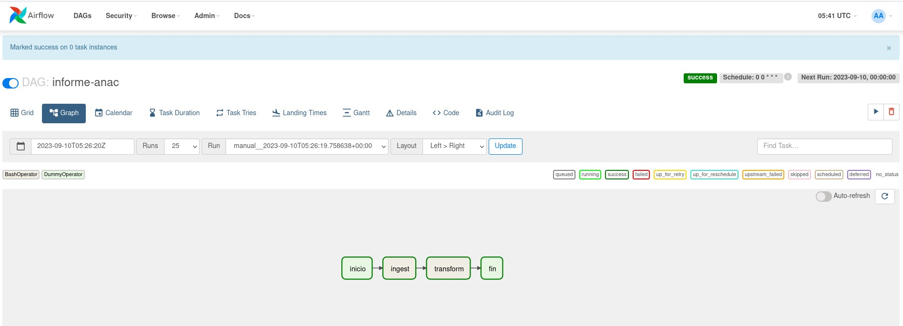
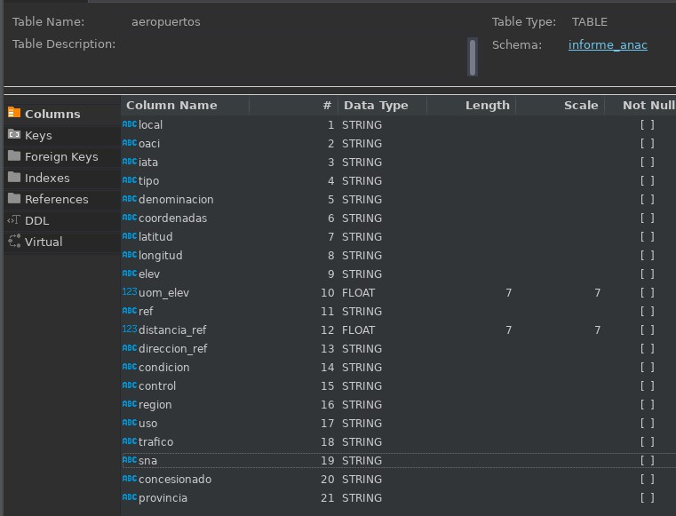
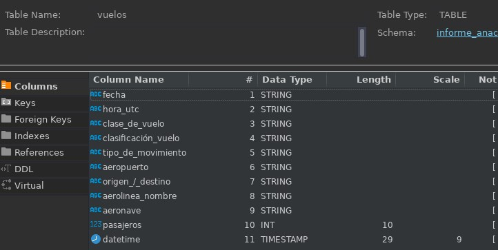
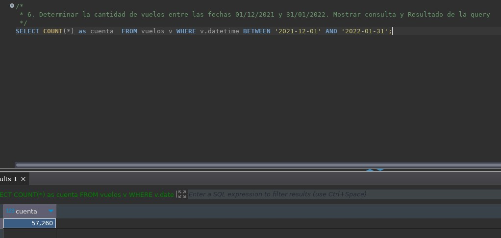
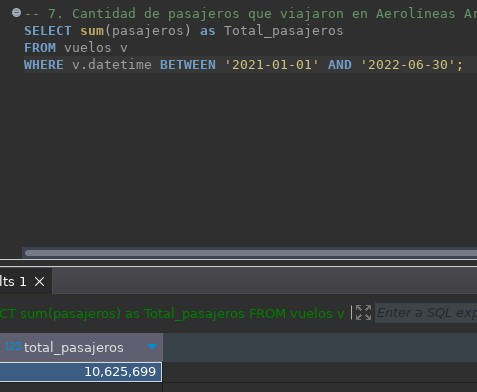
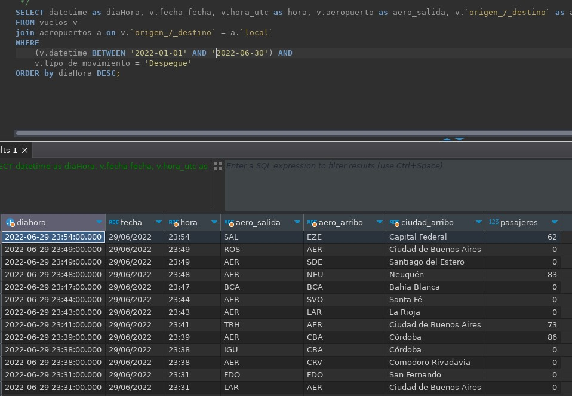
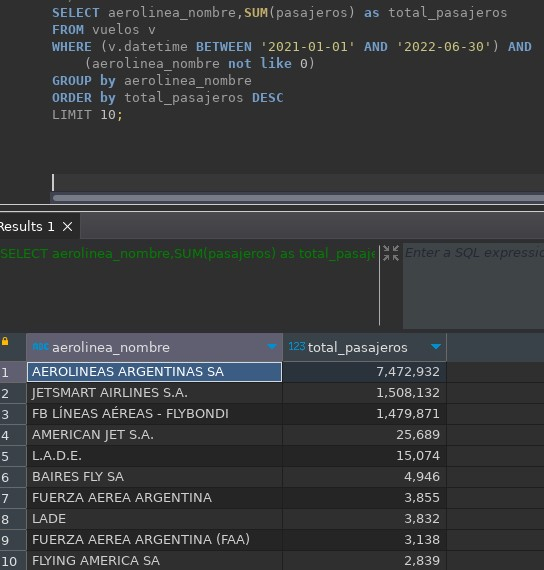
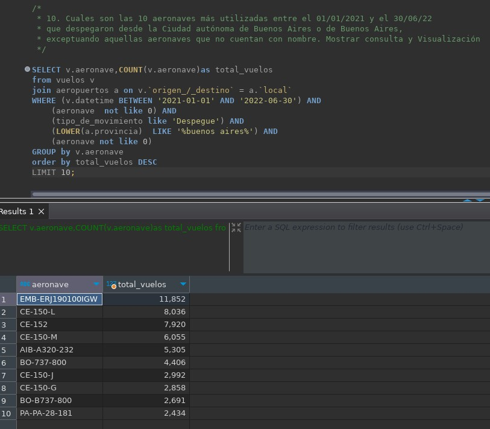

# Ejercicio 1 - Aviación civil
> La Administración Nacional de Aviación Civil necesita una serie de informes para elevar al ministerio de transporte acerca de los aterrizajes y despegues en todo el territorio Argentino, como puede ser: cuales aviones son los que más volaron, cuántos pasajeros volaron, ciudades de partidas y aterrizajes entre fechas determinadas, etc. Usted como data engineer deberá realizar un pipeline con esta información, automatizarlo y realizar los análisis de datos solicitados que permita responder las preguntas de negocio, y hacer sus recomendaciones con respecto al estado actual.

## Tareas
### Ingest
Ver `ingest-informe-anac.sh` que es ejecutado por el DAG de Airflow.
### Crear tablas en Hive
`docker cp edvai_hadoop:/home/hadoop/scripts/ <dirección de crea_tablas_informe-anac.hql>`
`hive -f /home/hadoop/scripts/crea_tablas_informe-anac.hql`
### Transformación
Ver `transform-informe-anac.py` que es ejecutado por el DAG de Airflow.
### Orquestación
El proceso completo se ejecuta desde Airflow, con el DAG `dag-informe-anac.py`

### Análisis de datos
Esquema de tablas:
- Esquema de tabla vuelos

- Esuema de tabla aeropuertos

6. Determinar la cantidad de vuelos entre las fechas 01/12/2021 y 31/01/2022. Mostrar consulta y Resultado de la query
   
7. Cantidad de pasajeros que viajaron en Aerolíneas Argentinas entre el 01/01/2021 y 30/06/2022. Mostrar consulta y Resultado de la query
   
8. Mostrar fecha, hora, código aeropuerto salida, ciudad de salida, código de aeropuerto de arribo, ciudad de arribo, y cantidad de pasajeros de cada vuelo, entre el 01/01/2022 y el 30/06/2022 ordenados por fecha de manera descendiente. Mostrar consulta y Resultado de la query
   
9.  Cuales son las 10 aerolíneas que más pasajeros llevaron entre el 01/01/2021 y el 30/06/2022 exceptuando aquellas aerolíneas que no tengan nombre. Mostrar consulta y Visualización
    
10.  Cuales son las 10 aeronaves más utilizadas entre el 01/01/2021 y el 30/06/22 que despegaron desde la Ciudad autónoma de Buenos Aires o de Buenos Aires, exceptuando aquellas aeronaves que no cuentan con nombre. Mostrar consulta y Visualización
    

## Conclusiones
- ¿Agregaría datos externos?
  Un dato faltante que podría facilitar una nueva profundidad de análisis es que este dataset de vuelos indique la cantidad de pasajeros que estan usando el vuelo en conexión con otros. Ya que ese es un dato importante para conocer el perfil del pasajero y es fundamental para poder determinar cual es el destino final de un pasajero, lo que es crucial si se quisieran producir estadísticas de servicios.
  Por otro lado encontré que las variables latitud y longitud del dataset de aeropuertos están invertidas.
  En el dataset de aeropuertos sería interesante tener algún dato de infraestructura, como cantidad de pistas o m2 de sus espacios de servicio a pasajeros, es un dato enriquecedor a la hora de saver si un aeropuerto está exedido de capacidad de darle servcicio sus pasajeros.
- Sobre el proyecto
  Es un buen ejercicio para crear un buen pipeline simple de principio a fin con la capacidad de escalar en volumen de datos. Además es muy positivo poder usar el portal de datos del estado, ya que en los últimos años han estado trabajando en él y es bueno ejercitarse con datos reales y familiares.
- Si este proyecto debiera montarse en la nube, usando Google Cloud Plataform como ejemplo, se podría pensar en la siquiente arquitectura análoga a la utilizada on premise:
  - Google cloud storage como almacenamiento crudo
  - Google Big Query como data warehouse
  - Google DataProc como herramienta de procesamiento
  - Google Cloud Composer como orquestador
Ya que es un trabajo de lotes bastante poco variables y ya organizados no creo que sea recomendable pensar en una lógica de ELT, los datos estan en un formato de tabla que se aplica muy bien a un datawarehouse como opción de almacenamiento. Además tienen una lógica relacional entre las dos tablas.